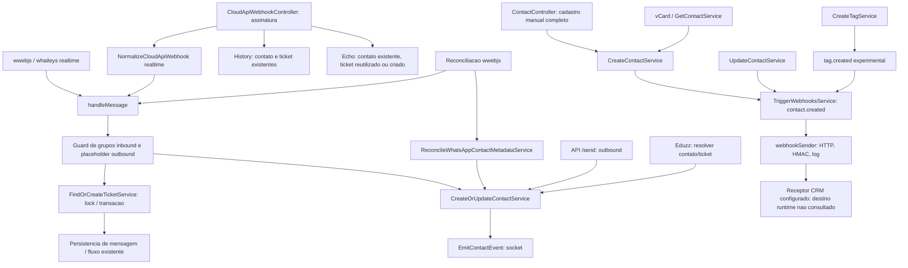

# P02-R06 - Contrato Tecnico SamaChat <-> CRM Samacon

Data de referencia: 2026-10-02. Risco: R3. Modo: auditoria sistemica e execucao documental isolada.
Resultado apos reconciliacao documental autorizada: **P02_R06_DOCUMENTAL_PASS**. Status anterior: P02_R06_BLOQUEADO, preservado no historico do TXT. Este documento continua sendo uma proposta tecnica rastreavel, nao uma implementacao, homologacao conjunta ou release.

P02_INTEGRACAO=EM_ANDAMENTO
INTEGRACAO_FUNCIONAL=NAO_IMPLEMENTADA
CONTRATO_M2M_CRM=PENDENTE_DE_VALIDACAO_CRM
PROMOCAO=NAO_AUTORIZADA

## 1. Identidade, baseline e limites

- Projeto de origem: alcancehub-wq/samachat; remote confirmado por Git: https://github.com/alcancehub-wq/samachat.git.
- Original: D:/Samacon/whaticket; branch fix/p05-reconcile-ticket-auth-20260827; HEAD a41b8b32d6e7469e4c0e81e063ae1d3787bcc921; seis entradas locais preexistentes, preservadas.
- Base documental: f91b35d52b84e28a51512e10ee18cf58bdd850c0, commit de 2026-09-29. `git ls-remote origin refs/heads/legacy-prod` confirmou esse SHA nesta rodada, sem fetch. A branch local legacy-prod esta em 4a88405002d47b6262edb74a58f30168f1bc2671 e nao foi utilizada como baseline atual.
- Isolamento: D:/Samacon/worktrees/samachat-crm-p02-r06-20261002; branch docs/samachat-crm-p02-r06-20261002; criada limpa no SHA remoto comprovado. Nao reutiliza branch suja.
- CRM: projeto distinto alcancehub-wq/scope-nest-a66a14dd. Foram consultados apenas documentos, registros Git e inventarios de nomes. Nenhum codigo operacional CRM foi editado ou executado; nenhum banco foi consultado nesta rodada.
- Producao SamaChat: revisao remota comprovada; revisao efetivamente carregada e comportamento de integracao em runtime NAO COMPROVADOS. Nao houve navegador, consulta a painel ou request de aplicacao.
- Producao CRM: E27 registra aplicacao SQL autorizada por OUTRA atividade em 2026-10-02, com verificacao posterior. E28/E29 eram o snapshot das 09:53. Durante esta auditoria, outra atividade avancou o HEAD ONE DEAL de 2af00da436bbbd422cb0346eec80a00bdff10c86 para b488a8352cf07981dbe46ba9997c8b3dc3cd639c. E36 registra build/push de UI; E37 registra dispatch de deploy em 10:05:26, mas termina BLOCKED por falha de consulta do run. Conclusao do deploy, E2E e receptor externo SamaChat NAO COMPROVADOS. Nao certificar baseline CRM global preservado; nenhuma dessas mutacoes foi feita por esta atividade.
- Nomes SAMACON/SAMACOM no pedido referem-se ao projeto CRM separado identificado pelo remote; nenhuma segunda instancia foi presumida.

### Limitacoes de acesso e classificacoes reconciliadas

Segundo declaracao expressa do responsavel no Prompt Corretivo, os protocolos PES e SAMACON foram apresentados ao responsavel nesta conversa. Seus textos integrais nao foram disponibilizados ao agente na execucao anterior; nao houve nova leitura integral na reconciliacao. Preservar a limitacao de acesso, sem declarar inspecao independente ou conformidade com clausulas nao lidas. Os gates explicitamente exigidos pelo Prompt Master foram confrontados com as evidencias obtidas na secao 17; a limitacao nao invalida automaticamente o contrato tecnico proposto.

Na auditoria anterior, o checklist geral AUDITORIA_CRM_CHECKLIST_MESTRE.md foi consultado nos checkouts dev e ONE DEAL, com SHA256 identico registrado no TXT. O checklist comercial especifico atualizado nao foi recuperado: **CHECKLIST_COMERCIAL_CRM_ATUAL=NAO_RECUPERADO_NA_AUDITORIA_ANTERIOR**. E36/E37 mantem o limite documental de 2026-10-02 10:05:40, sem serem substitutos desse checklist. A limitacao fica registrada como dependencia para a futura homologacao funcional, nao como falha de completude deste contrato PROPOSTO. Nao houve nova busca, leitura CRM ou acompanhamento do deploy nesta reconciliacao.

R01-R03 continuam registrados pelas evidencias de 2026-10-01. P01 permanece concluido conforme contexto anterior fornecido, com auditorias disponiveis e sem inventar o selo integral nao inspecionado. Essa limitacao de acesso nao e um gate adicional de reexecucao de P01 ou impedimento documental de R06.

P02_R04=CANCELADO_NAO_EXECUTADO: o responsavel cancelou expressamente o micropasso antes da execucao devido a evolucao paralela do CRM. Nao e auditoria ausente nem impedimento documental de R06.

P02_R05=EXECUCAO_DOCUMENTAL_REGISTRADA_NO_HISTORICO
P02_R05_EVIDENCIA_ORIGINAL_NAO_INSPECIONADA_NESTA_RODADA=SIM
A matriz de identidade de R05 foi concluida documentalmente na conversa anterior com TXT consolidado, conforme declaracao do responsavel. Seu arquivo original nao estava disponivel no checkout deste agente. Nao houve nova inspecao, hash, caminho local presumido, validacao independente ou reexecucao de R05.

Ausencia de mutacao do CRM por esta execucao: registrada. Preservacao global do CRM por todas as atividades paralelas: nao certificada, nem exigida como gate de aceite DOCUMENTAL deste pacote isolado. Homologacao definitiva M2M: pendente. Os fatos historicos de SQL/push/dispatch permanecem separados da validacao funcional; a reconciliacao nao tenta estabilizar, corrigir ou acompanhar o CRM.

## 2. Catalogo de evidencias

E01-E24, E31-E34 referem-se ao checkout isolado, sempre no baseline f91b35d. Numeros indicam linhas iniciais e simbolos de ancoragem, nao prova de runtime. E25-E30/E35-E37 sao documentos externos somente leitura. O TXT inclui hashes das fontes determinantes.

| Ref | Arquivo real / referencia exata | O que permite afirmar |
| --- | --- | --- |
| E01 | backend/src/services/ContactServices/CreateOrUpdateContactService.ts:127, CreateOrUpdateContactService; shouldMerge; Contact.create | Concilia numero/LID, reutiliza/cria contato e emite socket; nao dispara TriggerWebhooksService |
| E02 | backend/src/services/ContactServices/CreateContactService.ts:85, TriggerWebhooksService | Criacao por este servico emite contact.created externo apos persistencia/reload, sem await do disparo |
| E03 | backend/src/services/ContactServices/UpdateContactService.ts:149 | Atualizacao manual emite contact.updated externo, com contato plain |
| E04 | backend/src/helpers/EmitContactEvent.ts:12, EmitContactEvent | Evento socket contact em salas globais/por conexao, distinto de webhook |
| E05 | backend/src/helpers/BuildEquivalentContactNumberCandidates.ts:47 | Candidatos brasileiros com/sem 55 e variantes do nono digito |
| E06 | backend/src/helpers/ResolveContactName.ts:42 | Nome significativo existente tem precedencia sobre nome recebido |
| E07 | backend/src/models/Contact.ts:21, Contact | ID numerico local; number/lid Unique no modelo; nao apresenta org_id ou UUID CRM |
| E08 | backend/src/handlers/handleWhatsappEvents.ts:426, handleMessage; chamadas de CreateOrUpdateContactService e FindOrCreateTicketService | Handler comum; guard de grupo inbound antes da identidade; fromMe tambem passa pela identidade |
| E09 | backend/src/controllers/CloudApiWebhookController.ts:107, receive | Valida assinatura; separa history, ACKs, echo de coexistencia e realtime; realtime chama handleMessage |
| E10 | backend/src/services/CloudApiWebhookServices/ProcessCloudApiHistoryWebhook.ts:148 | Historico procura contato/ticket existentes; nao usa criacao de contato; persistencia silenciosa de mensagens |
| E11 | backend/src/services/CloudApiWebhookServices/ProcessCloudApiMessageEchoWebhook.ts:43 | Echo exige contato existente; pode criar ticket, nao contato; persiste fromMe |
| E12 | backend/src/providers/WhatsApp/Implementations/wwebjs.ts:2357 | message, message_create, media_uploaded; guard de dedupe/echo; fromMe filtrado em message, nao incondicionalmente nos demais |
| E13 | backend/src/providers/WhatsApp/Implementations/whaileys.ts:1014 | notify e append fromMe; processamento paralelo por Promise.all |
| E14 | backend/src/controllers/ContactController.ts:154, registration; :224, CreateContactService | Cadastro manual exige completude e verifica equivalencia antes/depois do lookup |
| E15 | backend/src/controllers/ApiController.ts:32, createContact; :53 | /send cria/reutiliza contato e ticket e envia mensagem; nao e endpoint puro de lead |
| E16 | backend/src/routes/apiRoutes.ts:12 | /send protegido por isAuthApi; nao foi chamado |
| E17 | backend/src/services/WhatsappService/ReconcileWhatsAppContactMetadataService.ts:68 | Reconcilia metadata via servico canonico, sem duplicar identidade/nome/foto |
| E18 | backend/src/providers/WhatsApp/Implementations/wwebjsReconciliationBridge.ts:40, buildMessageWorkItem | Reconcilia mensagens usando o mesmo handleMessage; nao ha marcador de historico no contrato atual do handler |
| E19 | backend/src/services/TicketServices/FindOrCreateTicketService.ts:171 | Transacao e lock do contato; procura ticket operacional e cria se necessario |
| E20 | backend/src/services/TicketServices/ResolveOperationalTicketService.ts:15, ResolveOperationalTicketService | Escopo por conexao apenas com allowMultipleConversations; mais de um ativo em modo unico gera 409 |
| E21 | backend/src/services/ContactServices/MergeContactService.ts:52, haveEquivalentIdentity; consolidateActiveTickets | Merge explicito tem regras de identidade/responsavel; nao equivale ao ramo automatico shouldMerge |
| E22 | backend/src/services/WebhookServices/TriggerWebhooksService.ts:13, buildPayload; :39, buildLeadWebhookPayload; :111, TriggerWebhooksService | Fanout de webhooks ativos; payload generico e adaptador experimental por tag.created + substring /lead-webhook |
| E23 | backend/src/services/WebhookServices/webhookSender.ts:22, buildSignature; :31, MAX_RETRIES; :37, sendWebhookRequest | HMAC SHA256 do JSON; HTTP/HTTPS; 8s; uma retentativa de erro de rede; status/body sem validar persistencia |
| E24 | backend/src/services/WebhookServices/webhookEvents.ts:1 | Catalogo declarado: contact/tag/list/dialog/campaign/integration/webhook com created/updated/deleted |
| E25 | D:/Samacon/auditorias/SAMACHAT-CRM-WEBHOOK-P01-R03-CRM-RECEIVER-SOURCE-MAP-20260929-173226.txt, secoes 05/06, MATCH index.ts:126,158,254,325 | Receptor historico usa x-lead-secret, org padrao, escolha SDR/primeiro pipeline e dedupe por contato+pipeline; nao e contrato definitivo |
| E26 | D:/Samacon/auditorias/SAMACHAT-CRM-P02-R02-CONTRACT-DISCOVERY-20261001-104844.txt, TARGETED CONTRACTS | Existencia historica de wrappers/RPCs de contato, deal e handoff; nao comprova vigencia em producao |
| E27 | D:/Samacon/CRM/_auditorias/CRM-P03-R19-R22N-TERMINAL-PRODUCTION-APPLY.txt, secoes 02/08/09 e STATUS | Registro de 2026-10-02 09:50:01: aplicacao SQL no projeto canonico e verificacao posterior; HEAD 2af00da436bbbd422cb0346eec80a00bdff10c86 |
| E28 | D:/Samacon/CRM/_auditorias/CRM-P03-R19-R22O-FINAL-RELEASE-PATH.txt, secao 03 e fechamento | Artefatos de oportunidades e gate VITE_P03_ONE_DEAL_ENABLED; frontend production promotion NOT_EXECUTED_BY_THIS_STEP; PILOT_E2E=PENDING |
| E29 | D:/Samacon/CRM/_auditorias/CRM-P03-R19-R22P-FINAL-DEPLOY-CONTRACT.txt, secoes 02/03/04 | Flag sem ocorrencias no workflow; dev remoto 54d4166 e feature 2af00da; DEPLOY=FALSE nessa etapa |
| E30 | D:/Samacon/CRM/scope-nest-dev/AUDITORIA_CRM_CHECKLIST_MESTRE.md, secoes 0,2.3.1,9; copia ONE DEAL identica | Checklist geral historico; HTTP 200 de webhook nao confirma persistencia; ausencia de fechamento comercial atual |
| E31 | backend/src/routes/webhookRoutes.ts:7 | CRUD, logs e teste com isAuth/checkSectorPermission; rota test e mutavel e nao foi acionada |
| E32 | backend/src/services/WebhookServices/TestWebhookService.ts:14, TestWebhookService | Envia webhook.test, cria log e atualiza lastTestAt; somente leitura nesta auditoria |
| E33 | backend/src/services/WebhookServices/CreateWebhookService.ts:22, CreateWebhookService | Aceita HTTP/HTTPS, headers serializados, secret gerado por uuidv4 e integracao opcional |
| E34 | backend/src/models/WebhookLog.ts:17 | Registra request/response body, HTTP, duracao e erro; nao possui recibo comercial/event_id contratual |
| E35 | D:/Samacon/CRM/scope-nest-one-deal-impl-20261001/docs/ARCH_idempotency.md, Tabelas de Eventos / Garantias | Documentacao de idempotencia interna por request_id/idempotency_key, nao garantia do ingress SamaChat |
| E36 | D:/Samacon/CRM/_auditorias/CRM-P03-R19-R22S-PILOT-UI-RELEASE.txt, secoes 04/05/06 e STATUS | Registro de 2026-10-02 10:01:49: build e push da UI piloto b488a835; FTP_DEPLOY=FALSE nessa etapa |
| E37 | D:/Samacon/CRM/_auditorias/CRM-P03-R19-R22T-PRODUCTION-DEPLOY.txt, secoes 05/06/07 e STATUS | Registro de 2026-10-02 10:05:26: dispatch autorizado por outra atividade; run_id agregado indevidamente no registro; DEPLOY_RUN_STATUS_QUERY_FAILED e P03_R19_R22T_BLOCKED; conclusao nao comprovada |

## 3. Mapa do fluxo real



A criacao automatica NAO compartilha o disparo externo manual. O catalogo de eventos nao comprova que todo evento declarado possui produtor: a busca de consumidores nesta base confirmou chamadas em contato, tags, campanhas e integracoes. List/dialog/webhook no catalogo nao foram classificados como produtores comprovados. Criacao de etiqueta nao e atribuicao de etiqueta a um contato.

Consumidores adicionais da identidade: ApiController, handleMessage, ResolveEduzzContactTicketService e ReconcileWhatsAppContactMetadataService. CreateContactService tambem e chamado pelo processVcardMessage e GetContactService. Estes usos foram localizados por busca estatica; nenhuma API/envio foi executada.

Ticket nao e oportunidade. Em modo de conversa unica, a resolucao pode reutilizar ticket em outra conexao; em modo multiplo aplica whatsappId. O contato e global na superficie legada inspecionada. Nao adicionar particionamento por conexao a sua identidade por suposicao.

## 4. Diagnostico e riscos existentes

| Area | Confirmado no codigo/documentacao | Lacuna / limite |
| --- | --- | --- |
| Identidade local | Numero equivalente, LID separado, contato preferido pelo ticket ativo, nome significativo preservado | Model Unique nao prova constraint atual de banco; contato automatico tem find/create sem transacao ou retry de conflito nesse servico |
| Merge automatico | Reaponta tickets, destroi contato LID e atualiza contato por numero | Operacoes sem transacao explicita no ramo; nao ha evento externo de alias; nao assumir remapeamento completo de todas as relacoes |
| Cadastro incompleto | Automatico aceita numero nulo se LID presente; manual via controller exige campos de cadastro | Nao transportar LID como telefone, fabricar email ou completar informacao comercial |
| Entrega | Fanout paralelo por webhook; sender retry de rede uma vez e timeout 8s | Sem ID de evento estavel, journal duravel de intencao, backoff HTTP ou recibo de negocio na superficie auditada |
| Erros | Lookup Webhook.findAll falho retorna silenciosamente; chamada manual usa void | Falha pode nao chegar ao cadastro chamador; log bem-sucedido de HTTP 4xx/5xx fica error=null; falha do proprio log pode rejeitar Promise |
| HTTP | Corpo e status sao registrados, nao interpretados; attempted nao e persistido no log | 200, 202 ou texto livre nao comprovam contato, negocio ou oportunidade |
| Payload legado | Contato plain com extraInfo/tags; adaptador tag usa campos de formulario fixos | Excesso de dados e valores experimentais; nao reproduzidos aqui nem reutilizados no contrato |
| Organizacao | CRM historico tinha org padrao e pipeline por heuristica | Contrato novo deve vincular credencial/instancia/org explicitamente, sem fallback a primeira org/pipeline |
| Producao | E27 prova documental de SQL aplicado; E36 build/push e E37 dispatch por outro fluxo | E37 bloqueia confirmacao do deploy; E2E/ingress/politica de admissao PENDENTE_DE_VALIDACAO_CRM; HEAD paralelo mudou |

Nenhum desses problemas foi corrigido. Risco de resultado fantasma: transporte e log podem indicar resposta recebida sem identificadores de persistencia confirmados; timeout pode ocorrer apos o CRM efetivamente gravar. Ambos exigem reconciliacao, nao nova criacao cega.

## 5. Matriz de identidade e propriedade

Todos os itens desta secao sao **PROPOSTOS**, preservando E01/E05/E06. Nao sao schema implantado.

| Identificador / campo | Regra de vinculo / fonte da verdade | Origem -> destino |
| --- | --- | --- |
| Contato origem | Chave (source_system=samachat, source_instance_id, source_contact_id); ID local serializado string decimal positiva | SamaChat -> CRM |
| Escopo | source_instance_id identifica instalacao, nao telefone, conexao ou hostname transitivo; integration_id identifica canal autorizado | Provisionamento aprovado -> ambos |
| CRM contact_id | UUID independente; mapeamento externo canonico pertence ao CRM, unico por org+origem+instancia+ID | CRM -> recibo SamaChat |
| phone_e164 | Derivado apenas de telefone plausivel com pais resolvido; ausencia=null; nao assumir 55 para todo numero | SamaChat normaliza candidatos -> CRM resolve identidade org-scoped |
| phone_equivalence | Reutilizar E05 para candidatos brasileiros; candidatos nao sao certeza de propriedade e nao autorizam merge de duas pessoas | SamaChat -> resolver CRM |
| LID | Alias de provedor, nunca telefone nem UUID CRM; escopado por instancia+conexao, ate o CRM aprovar dominio de unicidade | SamaChat -> CRM apenas quando necessario |
| Nome | Preservar nome significativo local E06; CRM preserva nome curado por humano; preencher somente vazio ou menos confiavel com proveniencia | SamaChat -> CRM; conflitos ficam registrados, nao last-write-wins |
| Email, cidade, estado | Opcionais, curacao comercial e prevalencia CRM; ausencia nao apaga campo; sincronizar so campos autorizados | SamaChat -> CRM, sem sobrescrever valor curado |
| captureChannel / completude | Proveniencia operacional SamaChat; usar avaliador existente, nao nova regra divergente | SamaChat -> CRM como metadata minima |
| Tags, indicacao, notas, foto, mensagens | Nao sao dados minimos; excluidos do payload v1 por padrao | Permanecem em origem, sem copia automatica |
| primary_deal_id / journey_id | Negocio principal/jornada persistente, fonte CRM; representacao definitiva PENDENTE_DE_VALIDACAO_CRM | CRM -> leitura/recibo |
| opportunity_id | UUID comercial independente; nao confundir com deal, ticket ou contact_id | CRM -> leitura/recibo |
| pipeline, stage, owner, agenda, outcome | CRM governa e autoriza; SamaChat/SDR nao os escolhem por nomes, primeira linha ou fallback | CRM -> estado comercial; comandos expressam intencao |

Resolucao proposta: primeiro binding externo; depois telefone e aliases validados em uma unica org; multiplos candidatos -> identity_conflict sem merge automatico entre sistemas. Nome/email isolados nao autorizam unificar contatos. Contato previamente sincronizado retorna o mesmo UUID e os mesmos vinculos. Troca de conexao nao cria nova identidade CRM. Mudanca de org nunca reaproveita binding de outra org.

Merge local posterior exige transferencia controlada do binding e alias old_source_contact_id -> surviving_source_contact_id, com prova de merge de origem. Se ambos estiverem ligados a UUIDs CRM diferentes, bloquear em PENDENTE_RECONCILIACAO; nao destruir dados CRM. Restauracao de backup que reutilize IDs exige nova geracao de instancia ou restabelecimento auditado do binding; nunca remapear por ID isolado.

## 6. Entrada elegivel e arquitetura proposta

- **Novo contato:** registro local novo, nao necessariamente pessoa nova no CRM. Sincronizacao inicial apos persistencia da identidade, com contexto de origem autorizado.
- **Contato existente:** reutilizacao nao gera novo comando comercial; pode gerar upsert apenas se mudou metadata compartilhada, se ha intencao elegivel ainda pendente ou se o binding ainda nao existe.
- **Nova oportunidade:** intencao comercial explicita e autorizada pelo CRM, independente de quantidade de mensagens, criacao de ticket ou troca de conexao.
- **Evento inicial correto, proposto:** samachat.crm.contact.upsert.requested, versao 1. Nao reutilizar contact socket, tag.created ou webhook.test como admissao de lead.
- **Elegibilidade automatica:** inbound individual realtime de provedor validado, nao fromMe, nao grupo, nao echo, nao ACK, nao historico, identidade local persistida, integracao e org autorizadas. Nao depende de existir texto: midia valida pode iniciar cadastro. No futuro, contexto desconhecido -> inelegivel por padrao.
- **Cadastro manual:** pode sincronizar contato quando a organizacao autorizar esse canal, sem admissao comercial implicita. vCard, GetContactService, API outbound e Eduzz nao herdam elegibilidade inbound.
- **Cadastro incompleto com telefone valido:** propor upsert minimo com registration.complete=false e missing_fields; o CRM pode adiar processamento por requisitos proprios, sem preencher ficticiamente.
- **LID sem telefone valido:** reter intencao na origem em PENDENTE_RECONCILIACAO(reason=identity_incomplete). Nao criar contato/oportunidade comercial no CRM enquanto o contrato LID-only nao for homologado. Enriquecimento posterior retoma a mesma identidade e nunca multiplica a admissao.
- **Mensagens repetidas:** nao produzir novo upsert se a revisao semantica compartilhada nao mudou; nao incrementar revisao por updatedAt, foto ou recepcao de mensagem.

Arquitetura minima proposta: provedor com proveniencia -> servico canonico de identidade existente -> intencao de sincronizacao duravel -> worker de entrega -> ingress CRM org-scoped -> resolver/binding canonico -> recibo persistido -> confirmacao na origem. Falha de CRM nao bloqueia nem altera conversa WhatsApp. Nenhum frontend e necessario para iniciar esse fluxo.

Admissao comercial e separada: samachat.crm.lead.admission.requested v1, emitida no maximo uma vez por identidade/admission_key para uma politica de entrada aprovada. O CRM resolve contato, preserva negocio principal e reutiliza oportunidade existente; pode abrir a primeira oportunidade somente se sua politica vigente permitir e seu gateway estiver homologado. Para contato com ciclo comercial anterior, nunca criar recompra automaticamente por nova mensagem. Retornar requires_authorization ou reused segundo regra CRM. Nesta rodada a politica permanece **PENDENTE_DE_VALIDACAO_CRM**, portanto nenhuma admissao e considerada liberada.

## 7. Matriz de responsabilidades e preservacao

| Capacidade | SamaChat | CRM | Agente SDR futuro | Existente / necessario / preservacao |
| --- | --- | --- | --- | --- |
| Identidade de origem | Resolve contato/telefone/LID com E01/E05 | Resolve pessoa na org e guarda binding externo | Consulta, nao cria identidade paralela | Reusar dedupe local; binding externo ainda necessario, nao comprovado |
| Evento elegivel | Classifica proveniencia e delta; intencao duravel | Valida envelope, autorizacao e inbox idempotente | Nao transforma toda mensagem em lead | Proveniencia e journal nao atendidos pelo socket/log generico |
| Transporte | Entrega e guarda tentativa/recibo | Confirma consumo e persistencia | Sem retry paralelo | Reusar HTTP/HMAC quando compativeis; politica CRM isolada, nao alterar webhooks existentes |
| Campos cadastrais | Fonte de identificadores e origem; preserva curacao local | Fonte de cadastro comercial curado | Solicita enriquecimento com proveniencia | Sem replicacao integral ou sobrescrita bilateral irrestrita |
| Jornada e oportunidade | Referencias opacas, sem mini-CRM | Fonte da verdade, regras e transacao comercial | Solicita admissao/qualificacao/avanco | Preservar ONE DEAL / ONE JOURNEY; nunca arquivar Closer para reativar copia SDR |
| Agenda/handoff/No-show | Apenas transporta pedidos/retornos aprovados | Decide disponibilidade, responsavel, transicao e evento | Solicita e acompanha retorno | Capacidades futuras; nenhuma implementacao nesta rodada |
| Reconciliacao | Consulta recibo por event_id; reenvia mesma intencao | Responde com resultado duravel e conflitos | Nao cria fallback comercial | Necessaria porque timeout/log HTTP nao provam resultado |

Justificativas das garantias novas: E05 ja cobre equivalencia local, portanto nao propor outro deduplicador de telefone no SamaChat. E19 protege tickets, nao eventos externos. E35 descreve eventos internos CRM, nao binding/ingress. E23 faz retry de rede em memoria, insuficiente para restart e resposta HTTP sem persistencia. E34 guarda transporte, nao intencao antes do envio nem resultado por event_id. Journal de origem e inbox CRM sao garantias em lados diferentes da entrega at-least-once, nao dois dedupes concorrentes de contatos. Reusar o armazenamento/worker existente se homologado; nao introduzir outro broker por preferencia.

## 8. Contrato de eventos proposto v1

Endpoint, referencia de credencial, quotas, org autorizada e interfaces CRM concretas: **PENDENTE_DE_VALIDACAO_CRM**. Nenhuma URL real e publicada como endpoint definitivo. Direcao inicial SamaChat -> CRM via POST JSON/HTTPS; consultas de recibo e retorno CRM -> SamaChat exigem contrato autenticado homologado, nao um endpoint inventado.

| Nome | Versao | Operacao | Resultado esperado |
| --- | --- | --- | --- |
| samachat.crm.contact.upsert.requested | 1 | upsert_contact | Resolver/criar/enriquecer contato, com UUID e recibo; nenhuma operacao comercial implicita |
| samachat.crm.contact.identity.merged | 1 | reconcile_identity | Remapear binding/alias apos merge comprovado ou sinalizar conflito; sem merge CRM cego |
| samachat.crm.lead.admission.requested | 1 | ensure_initial_admission | Reusar jornada/negocio e oportunidade vigente ou confirmar primeira admissao permitida; nunca recompra automatica |
| crm.samachat.operation.result | 1 | report_result | Retornar resultado duravel por event_id e org; nao supor callback disponivel |
| crm.sdr.no_show.returned | 1 | notify_no_show_return | Notificar retorno autorizado da oportunidade, sem operar agenda/handoff no SamaChat |

Estes nomes NAO existem no catalogo E24. `contact.created/updated/deleted`, `tag.created` e os demais E24 sao eventos existentes e permanecem inalterados. O adaptador experimental E22 nao e ponte v1.

### Envelope normativo proposto

Obrigatorios: event_id UUID v4 unico por intencao; event_name; schema_version=1; occurred_at UTC RFC3339; correlation_id UUID da sequencia; source_system; source_instance_id; integration_id; organization_id; operation; source_contact_id; source_revision inteiro positivo; context; data. causation_event_id opcional liga enriquecimento/admissao ao evento predecessor. Conexao e ticket sao contexto, nao chave de pessoa/comercio. IDs textuais nunca convertidos em UUID CRM por casting.

`context.channel` enum whatsapp_inbound|manual|reconciliation; `context.provenance` enum realtime|manual|history|echo|api_outbound|unknown; `context.from_me` e `context.is_group` booleanos obrigatorios. revision e monotona no journal por identidade, gerada apenas com mudanca semantica dos campos permitidos. O CRM nao aplica revisao menor para sobrescrever a maior. Eventos de merge usam surviving_source_contact_id e merged_source_contact_ids, com invariantes de mesma instancia/org.

Exemplo totalmente sintetico, sem telefone, email, nome real, token ou endpoint. Nao e evento elegivel de criacao CRM enquanto phone_e164=null.

```json
{
  "event_id": "00000000-0000-4000-8000-000000000001",
  "event_name": "samachat.crm.contact.upsert.requested",
  "schema_version": 1,
  "occurred_at": "2026-10-02T12:00:00Z",
  "correlation_id": "00000000-0000-4000-8000-000000000002",
  "source_system": "samachat",
  "source_instance_id": "synthetic-instance",
  "integration_id": "synthetic-integration",
  "organization_id": "00000000-0000-4000-8000-000000000003",
  "operation": "upsert_contact",
  "source_contact_id": "1",
  "source_revision": 1,
  "context": {
    "channel": "whatsapp_inbound",
    "provenance": "realtime",
    "whatsapp_connection_id": "synthetic-connection",
    "from_me": false,
    "is_group": false
  },
  "data": {
    "phone_e164": null,
    "provider_identity": { "type": "lid", "value": "synthetic-lid@lid" },
    "display_name": null,
    "registration": { "complete": false, "missing_fields": ["number"] }
  }
}
```

Campos opcionais omitidos significam nao modificar. Null em telefone indica desconhecido, nao ordem de apagar. Remocao exige outro contrato autorizado. `additionalProperties=false` no schema futuro de envelope/data, com extensao versionada explicita; limites propostos 32 KiB total, display_name 200 caracteres, listas ate 20 itens. Rejeitar tipos errados, datas futuras fora da janela permitida, IDs faltantes e versoes desconhecidas sem persistencia comercial. Schema executavel sera arquivo **PROPOSTO**, nao criado nesta rodada.

Admissao deve incluir contact_event_id confirmado, admission_key estavel por identidade+politica e commercial_policy_version homologada. Uma nova oportunidade futura exige commercial_intent_id proprio e expectativa de versao do estado CRM; reenvio preserva o mesmo ID. Nunca derivar admission_key de message_id, ticket_id ou whatsappId.

### Resposta e confirmacao

Resposta JSON proposta, obrigatoria para confirmacao: schema_version; event_id; organization_id; correlation_id; receipt_id; processing_state; contact_result; commercial_result; error. Receipt retornado em 202 representa somente aceitacao duravel; IDs definitivos sao emitidos apenas depois do commit CRM. A consulta de recibo deve ser org-scoped e retornar a ultima versao persistida, nao resultado calculado apenas em memoria.

```json
{
  "schema_version": 1,
  "event_id": "00000000-0000-4000-8000-000000000001",
  "organization_id": "00000000-0000-4000-8000-000000000003",
  "correlation_id": "00000000-0000-4000-8000-000000000002",
  "receipt_id": "00000000-0000-4000-8000-000000000004",
  "processing_state": "deferred_identity",
  "contact_result": { "status": "not_persisted", "crm_contact_id": null },
  "commercial_result": { "status": "not_requested", "primary_deal_id": null, "opportunity_id": null },
  "error": { "code": "identity_incomplete", "retryable": false }
}
```

processing_state enum accepted|processed|deferred_identity|partial|failed|ignored. contact_result.status enum not_persisted|created|reused|enriched|conflict; created/reused/enriched exigem crm_contact_id UUID e persisted_at UTC. commercial_result.status enum not_requested|created|reused|requires_authorization|deferred|failed; created/reused exigem primary_deal_id, opportunity_id, persisted_at e applied_policy_version. Forma definitiva de journey_id e sujeita ao CRM. `error=null` somente se nao houver erro; parcial informa o componente e codigo que falhou.

Duplicata retorna o recibo original e seus resultados, com duplicate=true; nunca responde sucesso generico. Validar identidade da resposta, tipos, org, IDs e relacao contato/negocio/oportunidade. 200 sem recibo valido -> PENDENTE_RECONCILIACAO. processed com contato ausente nao vira CONTATO_PERSISTIDO_NO_CRM. contact upsert pode terminar com contato confirmado e commercial_result=not_requested, sem erro e sem OPERACAO_COMERCIAL_CONFIRMADA.

## 9. Seguranca e autorizacao

Proposta preferencial: HMAC-SHA256 por integracao/org, reaproveitando a primitiva E23 sem alterar o protocolo generico existente. Contrato exato: assinatura v1 em hex do UTF-8 `sent_at + "\n" + event_id + "\n" + raw_body`. Headers propostos X-SamaChat-Signature-Version=1, X-SamaChat-Key-Id, X-SamaChat-Sent-At (UTC), X-SamaChat-Event-Id, X-SamaChat-Signature e Content-Type=application/json. Validacao constant-time, assinatura sobre bytes recebidos antes do parse, diferenca de relogio maxima proposta 300s. Em retry o corpo/event_id permanecem identicos; sent_at e assinatura sao renovados. E23 hoje assina SOMENTE o JSON, sem timestamp/key-id: nao e compativel silenciosamente com esta versao.

Key-id aponta referencia segura de secret no backend/secret manager, nao segredo no documento, payload, frontend ou log. Nenhum valor de credencial foi consultado/exportado nesta rodada. CRM vincula key-id -> integration_id -> source_instance_id -> organization_id permitidos; org do payload deve coincidir com credencial, nunca escolher org padrao. Rate limit por chave/org, limite de corpo, allowlist HTTPS/destino aprovado, sem redirecionamento a hosts nao aprovados. Sem service_role CRM entregue ao SamaChat; x-lead-secret historico nao e contrato v1.

Replay: janela assinada limita capturas recentes; inbox idempotente persistente impede repetir operacao mesmo dentro da janela e entre retries. Mesma chave/event_id com hash diferente -> 409 event_payload_conflict; sem efeitos. Retencao de recibos/aliases deve cobrir integralmente janela de replay e recuperacao; proposta minima 90 dias e binding enquanto houver relacao ativa, sujeita a politica LGPD CRM. Nao expirar uma chave e permitir recriar admissao ja confirmada. Rotacao com key-id e janela de coexistencia aprovada, sem alterar tokens Meta.

LID/telefone sao dados pessoais; acesso minimo, cifragem em transito e politica de retencao. Logs operacionais somente IDs tecnicos, estados/codigos, hashes e duracao; nao raw_body, nome, numero, email, LID, mensagens ou headers sensiveis. Logs genericos existentes E34 nao atendem por si a esta minimizacao: preservar legado e usar politica da integracao dedicada.

## 10. Confiabilidade, estados e falhas

Garantia proposta: entrega at-least-once, efeitos idempotentes; nao prometer exactly-once de rede. Inbox CRM e binding/operacao devem participar da transacao de negocio ou ter resultado parcial duravel identificavel. Origem guarda event_id e corpo antes da tentativa; apos crash, retoma o mesmo evento. Proposta de armazenamento duravel requer pacote futuro autorizado, nunca migration nesta rodada.

| Estado requerido | Evidencia necessaria / transicao | O que NAO significa |
| --- | --- | --- |
| EVENTO_ENVIADO | Tentativa local iniciada, timestamp e attempt_id | Recebimento remoto ou sucesso |
| TRANSPORTE_ACEITO | HTTP 2xx recebido; 202 com recibo aceito pode ser duravel | Processamento ou persistencia de contato |
| EVENTO_PROCESSADO | Recibo autenticado processed/ignored/deferred com resultado duravel verificavel | Que todos os componentes foram criados |
| CONTATO_PERSISTIDO_NO_CRM | UUID, org e persisted_at confirmados por recibo/readback apos commit | Negocio/oportunidade confirmados |
| OPERACAO_COMERCIAL_CONFIRMADA | Operacao explicitamente requerida; IDs principal/oportunidade, politica e timestamp apos commit | Permissao irrestrita para criar outro negocio |
| FALHA | Erro terminal classificado, componente/causa/attempt documentados | Rollback de contato ja confirmado |
| PENDENTE_RECONCILIACAO | Timeout/resultado malformado/parcial/identidade incompleta/conflito | Falha definitiva nem autorizacao para recriar |

Modelar marcos independentes por componente, nao unico booleano success. Ordenacao: envio -> transporte possivel -> processamento -> contato -> comercial apenas quando requerido. Callback pode confirmar persistencia mesmo apos timeout, sem transporte aceito observado pela origem. Parcial pode manter CONTATO_PERSISTIDO_NO_CRM e FALHA comercial ao mesmo tempo. Historico de marcos e imutavel; atualizacao nao apaga evidencias anteriores.

Politica proposta de timeout: manter limite de transporte de 8s como referencia inicial; CRM pode aceitar 202 com recibo duravel e processar assincronamente. Timeout nao cancela gravacao remota. Politica proposta de retry: um UNICO dono no worker da integracao no SamaChat; no maximo 5 tentativas de entrega, atrasos 30s/2min/10min/1h com jitter, janela total maxima 24h. Retry-After valido para 429/503 respeitado ate o limite; ao esgotar -> PENDENTE_RECONCILIACAO e alerta. Parametros dependem do SLA CRM.

Nao empilhar esses retries sobre a retentativa invisivel de E23. Futuro sender dedicado deve reutilizar funcao de transporte com controle explicito de uma tentativa por chamada, ou contabilizar e limitar as tentativas fisicas; escolher um so antes da implementacao. Webhooks genericos mantem seu comportamento atual.

| Falha/resposta | Acao proposta |
| --- | --- |
| DNS/conexao/timeout/5xx | Consultar recibo quando resultado incerto; retry da mesma intencao somente sob garantia idempotente |
| 400/422 ou versao invalida | FALHA de contrato, sem retry cego; corrigir em pacote autorizado |
| 401/403 | FALHA de autenticacao/org; suspender integracao e alertar, sem mudar credenciais automaticamente |
| 404 de endpoint | FALHA de configuracao, nao fallback para lead-webhook |
| 409 payload divergente / identidade ambigua | PENDENTE_RECONCILIACAO, sem nova identidade/merge cego |
| 429 | Retry-After e orcamento do dono de retry; sem loops concorrentes |
| 200/201 sem IDs/recibo coerente | TRANSPORTE_ACEITO + PENDENTE_RECONCILIACAO, nunca confirmar persistencia |
| 202 | TRANSPORTE_ACEITO; polling/retorno autenticado necessario |
| 3xx | Nao seguir redirecionamento fora do destino aprovado; erro de configuracao |
| Contato persistido, comercial falhou | Guardar UUID/binding; retomar somente mesma operacao comercial; nao repetir criacao de pessoa |
| Duas intencoes simultaneas | Unicidade inbox por org+origem+instancia+event_id; binding externo e admission_key unicos; serializar por identidade/revisao no CRM |

Reconciliacao proposta: recuperar recibos vencidos ou inconclusivos por event_id; comparar IDs e org; detectar aliases de merge; readback limitado com autorizacao; nenhuma importacao global automatica. Operador autoriza reapresentacao de item terminal, preservando event_id se a intencao e a mesma. Alteracao substantiva cria nova revisao e event_id com causation_event_id. Politica de DLQ pode ser estado no mesmo journal, nao fila nova obrigatoria.

Observabilidade: correlation_id de ponta a ponta, event_id, receipt_id, source_revision, integration_id, org tecnica, tentativa fisica, transporte, componentes confirmados e reason. Metricas propostas: intencoes elegiveis/ignoradas, pendencias por idade, retry, latencia, 4xx/5xx, parcial, conflito, duplicatas e confirmacoes. Alertar fila parada >15min, erro auth imediato e parcial >1h; thresholds finais CRM pendentes. Nunca somar HTTP 200 como lead convertido/persistido.

## 11. Interfaces do futuro Agente SDR

Somente contrato, todas **PENDENTE_DE_VALIDACAO_CRM**. Nao reutilizar diretamente RPC piloto autentica de usuario como credencial de servico. E28 referencia src/services/oneDealOpportunities.ts e p03_open_and_route_pilot_v1, mas nao comprova permissao M2M para SamaChat.

| Capacidade | Entrada contratual minima | Resposta / autoridade |
| --- | --- | --- |
| Consultar estado comercial | org, contact_id, principal/opportunity quando conhecidos, correlation_id | Estado/versao CRM e permissoes; sem mutacao |
| Solicitar qualificacao | opportunity_id, evidencias minimas, command_id, expected_version | CRM valida campos, aplica ou rejeita com motivo |
| Solicitar avanco | opportunity_id, intencao, expected_version, command_id | CRM decide etapa/pipeline; stale -> conflito |
| Consultar agenda | org, janela/fuso, criterio autorizado | CRM retorna disponibilidade, nao garantia de reserva |
| Solicitar reuniao | opportunity_id, slot referenciado, command_id | CRM valida conflito/responsavel e confirma meeting_id apos commit |
| Solicitar handoff | opportunity_id, intencao e versao, command_id | CRM decide regra, preserva negocio principal; nunca copiar/arquivar por conta do agente |
| Receber retorno No-show | evento CRM autenticado com meeting_id, opportunity_id, principal, org, correlation/causation | SDR reconhece uma vez e consulta estado; nao reagenda nem move etapa automaticamente |

Autorizacao, outcome e auditoria comercial pertencem ao CRM; SDR e solicitante, nunca fonte de verdade ou implementador de agenda. Handoff/No-show em evolucao paralela nao sao dependencias satisfeitas pelo SQL de oportunidades isoladamente.

## 12. Plano minimo futuro, NAO EXECUTADO

Arquivos referidos como existentes foram localizados na base inspecionada ou em documentos CRM com referencia expressa. PROPOSTO identifica arquivo inexistente. Nenhuma decisao abaixo autoriza implementacao ou alteracao de banco.

### A. Independentes do CRM, possiveis no SamaChat com nova autorizacao

| Alteracao / arquivo real ou PROPOSTO | Responsabilidade, justificativa e dependencias | Impacto/risco | Testes/regressao e aceite | Rollback |
| --- | --- | --- | --- | --- |
| Proveniencia opcional em backend/src/handlers/handleWhatsappEvents.ts; propagacao em backend/src/controllers/CloudApiWebhookController.ts e providers/WhatsApp/Implementations/wwebjs.ts, whaileys.ts, wwebjsReconciliationBridge.ts, wwebjsReconciliationAdapter.ts | Identificar realtime/history/echo/outbound no limite que conhece origem; nao inferir somente pelo servico de contato. Necessita fechar todos os callers, sem envio CRM | R3, assinatura compartilhada; default unknown inelegivel preserva fluxo | Reusar handlers/__tests__/handleWhatsappEvents.spec.ts e services/ContactServices/__tests__/CreateOrUpdateContactService.spec.ts; nenhum grupo/historico/fromMe elegivel; nenhum comportamento WhatsApp alterado | Reverter apenas commit futuro do pacote, flag desligada; manter dados/intencoes |
| Resultado de identidade/delta em backend/src/services/ContactServices/CreateOrUpdateContactService.ts; integracao com CreateContactService.ts, UpdateContactService.ts e MergeContactService.ts | Expor created/reused/enriched/merged sem trocar regras E01/E05/E06; manter API existente ou resultado opcional compatibilizado. Dependencia: proveniencia e metadados de merge | R3, contato canonico compartilhado; nao publicar webhook genericamente | Suites existentes de contato/merge, API, Eduzz e reconcilicao; nome significativo, ID local e tickets preservados; nenhuma chamada externa | Reverter extensao de metadata do pacote, nao desfazer merges de dados |
| PROPOSTO backend/src/services/CrmIntegrationServices/BuildCrmContactIntentService.ts; PROPOSTO backend/src/services/CrmIntegrationServices/__tests__/BuildCrmContactIntentService.spec.ts | Funcao pura de elegibilidade/minimizacao e envelope; nenhum HTTP/storage. Depende apenas das regras documentadas e contrato ainda versionado como proposta | R2 local; zero efeitos se nao conectado | T01-T11/T18-T20 com stubs; rejeitar unknown, sem efeitos CRM e sem payload plain | Remover apenas arquivos propostos nao ativados ou reverter commit futuro |

A nao deve ligar nenhum disparo nem persistir intencoes de producao. Esclarecer callback existente, callers, disponibilidade de testes e flag em contrato de implementacao separado. Nao criar flag/config real nesta rodada.

### B. Dependentes do contrato definitivo do CRM

| Alteracao / arquivo real ou PROPOSTO | Responsabilidade, justificativa e dependencias | Impacto/risco | Testes/regressao e aceite | Rollback |
| --- | --- | --- | --- | --- |
| PROPOSTOS backend/src/services/CrmIntegrationServices/CrmSyncJournalService.ts e DeliverCrmSyncIntentService.ts; pontos de persistencia nos servicos de contato acima | Journal duravel e recibos, com atomicidade entre mutacao elegivel e intencao, revisao semantica e alias de merge. E34 nao substitui journal. Storage/model/migration definitivos PENDENTE_DE_VALIDACAO_CRM e de autorizacao de schema SamaChat | R3; disponibilidade/durabilidade, crash-gap e concorrencia | T04-T08/T12-T19/T22; reinicio entre commit e envio nao perde intencao; nenhum replay recria negocio | Desligar entregas, preservar journal/bindings/recibos; rollback de codigo somente, sem apagar dados |
| Reuso controlado de backend/src/services/WebhookServices/webhookSender.ts via PROPOSTO CrmTransportService.ts na mesma pasta CrmIntegrationServices | Transporte dedicado e dono unico de retry, assinatura v1, HTTPS/allowlist e resposta tipada. Nao modificar TriggerWebhooksService/tag.created de integracoes atuais | R3, seguranca/ambiguidade HTTP; requer endpoint/auth/SLA definitivos | T05/T06/T12-T17/T20-T23; contar tentativas fisicas e nao promover 200 a persistencia | Desativar integracao especifica; restaurar transport adapter do pacote; sender generico preservado |
| Ingress/binding/inbox/recibo CRM, caminhos definitivos nao comprovados: PENDENTE_DE_VALIDACAO_CRM | Implementacao pertence a OUTRO pacote CRM. Reavaliar supabase/functions/lead-webhook/index.ts e _shared/createOrReuseContact.ts/_shared/createOrReuseDeal.ts, cuja existencia consta de E25/E26, sem assumir adequacao. Novo ingress, se necessario, **PROPOSTO com caminho a definir pelo CRM** | R3, dados reais/org; exige checklist atual, politica comercial, gateway M2M e rollout aprovado | T01-T23 em fixtures isoladas; org cruzada/replay/ONE DEAL/parcial/HTTP ghost comprovados; E2E e readback apos commit | Desligar admission/ingress e preservar dados; plano CRM autorizado especifico, nunca executar archive/reativar copia |
| Conexao da admissao e consulta de estado, arquivos SamaChat CrmIntegrationServices PROPOSTOS; referencia CRM src/services/oneDealOpportunities.ts somente via E28 | Usar contrato comercial homologado, nao copiar o client frontend nem conceder RPC piloto a M2M por suposicao | R3, principal persistente e nova oportunidade independente | T03/T04/T17-T23; existente reutiliza, nenhum novo ciclo por mensagem; primeira admissao somente pela politica aprovada | Desligar admissao mantendo sync cadastral e recibos; nao excluir oportunidades criadas |

### C. Fora de escopo

Agente SDR, agenda, handoff, No-show funcional, campanhas, pipelines, etapas, owners, permissoes, frontend comercial novo, dados reais, migrations nesta rodada, tokens/conexoes Meta, refatoracoes, correcoes dos riscos auditados e qualquer commit/push/deploy. Nao implementar mini-CRM no SamaChat. Nenhum caminho CRM definitivo de arquivo novo foi inventado.

## 13. Matriz de testes futura

**SOMENTE DEFINIDOS. NENHUM CENARIO FUNCIONAL FOI EXECUTADO NESTA RODADA.** Usar fixtures sinteticas, mocks de provedor/transporte e banco isolado autorizado depois; readback CRM nao e permitido implicitamente por este documento.

| ID | Cenario | Assercao de contrato e regressao |
| --- | --- | --- |
| T01 | Novo contato individual recebido | Identidade local persistida; um upsert; UUID confirmado; admissao separada e condicionada; socket preservado |
| T02 | Contato existente / mensagens repetidas | Mesmo UUID; nenhuma intencao adicional se sem delta; nenhuma oportunidade por mensagem |
| T03 | Mesmo contato em diferentes conexoes | Uma identidade CRM/org; conversa unica versus multipla conforme E20; nenhuma chave comercial por whatsappId |
| T04 | Duas mensagens simultaneas | Resultado de conflito local explicito quando aplicavel; no maximo um binding/admissao; transacao de ticket preservada |
| T05 | Evento duplicado / hash divergente | Mesmo evento retorna recibo original; corpo divergente 409; nenhum novo efeito |
| T06 | Retry / restart apos envio | event_id/corpo preservados; orcamento de tentativas fisicas unico; replay apos commit nao duplica |
| T07 | LID sem telefone valido | Numero null, intencao pendente; LID nao vira telefone; nenhum contato/oportunidade indevidos no CRM |
| T08 | Telefone equivalente | E05 preservado; resolver CRM reutiliza binding; multiplos candidatos bloqueiam, nao merge arbitrario |
| T09 | Cadastro manual e vCard | Manual completo via E14; sync opcional sem admissao implicita; vCard nao tratado como lead inbound |
| T10 | Grupo ignorado | Guard anterior a identidade inbound; nenhum evento de integracao/admissao para grupo em qualquer contexto |
| T11 | Mensagem atendente / echo / API outbound | Persistencia existente preservada; nenhum lead novo; cloud echo pode criar ticket, nunca oportunidade |
| T12 | CRM indisponivel / timeout apos commit | Conversa continua; pendencia registrada; consulta de recibo e retry idempotente; nao recriar pessoa |
| T13 | HTTP 200/201 sem persistencia / corpo invalido | So transporte aceito; nenhuma confirmacao de contato ou comercio; reconciliacao |
| T14 | Autenticacao invalida / assinatura alterada / replay | 401/403 ou rejeicao; zero efeito; alertar sem imprimir segredo |
| T15 | Organizacao incorreta | Payload/credencial/binding cross-org bloqueados; nenhum fallback a org ou pipeline padrao |
| T16 | 4xx/5xx/429/3xx | Classificacao correta; Retry-After/orcamento; nao seguir destino nao aprovado; sem loops duplos |
| T17 | Retorno parcial | Contato confirmado preservado; comercial falho/pendente separado; retoma mesma operacao |
| T18 | Contato previamente sincronizado | Mesmo binding/UUID; nao duplicar jornada ou oportunidade vigente |
| T19 | Enriquecimento posterior / ordem invertida | Revisao monotona; retomar LID-only; nao apagar campos curados; stale nao sobrescreve |
| T20 | Integracoes existentes | contact/tag/campaign/integration legado, Eduzz, /send e socket sem mudanca; adaptador experimental preservado |
| T21 | Historico/ACK/coexistencia e resync | Cloud history silencioso e caminho separado; wwebjs history com proveniencia; zero admissao de historico |
| T22 | Merge apos sync / duas identidades CRM | Alias de origem preservado; conflito nao destrutivo; nenhum contato real apagado pelo reconciliador |
| T23 | Nenhuma criacao indevida de negocio / oportunidade | Upsert-only nunca comercial; admission existente reutiliza; recompra/handoff exige autorizacao CRM; sem archive/reativar copia |
| T24 | Callback de resultado/No-show duplicado | Auth/org/event_id obrigatorios; reconhecimento unico; nao mover pipeline, reagendar ou enviar WhatsApp |

## 14. Decisoes e criterios de aceite

AD01 preservar identidade/normalizacao/curacao e controles de ticket existentes. AD02 evento socket nao e webhook. AD03 nao reutilizar tag.created/lead-webhook experimental como contrato. AD04 separar sync cadastral, admissao inicial e nova oportunidade. AD05 CRM e fonte comercial e do binding. AD06 at-least-once com resultados por componente e reconciliacao, nao HTTP-success generico. AD07 mecanismo de retry unico, dedicado e justificado. AD08 flags/credenciais/schema/ativacao somente em pacote futuro autorizado. AD09 rollout comercial condicionado ao checklist CRM atual, ao receptor M2M e E2E. AD10 nenhuma copia/arquivamento Closer -> SDR legado.

Aceite DOCUMENTAL: tres arquivos preexistentes exclusivamente documentais na worktree esperada; branch/HEAD/remote/escopo conferidos; engenharia tecnica preservada; referencias e classificacoes alteradas rastreaveis; PES completo; matrizes/plano/testes definidos; limitacoes explicitadas; releitura, validacao estatica, diff-check incluindo untracked, original preservado e TXT fisico. Esses gates sustentam **P02_R06_DOCUMENTAL_PASS**. Declaracao historica do responsavel nao e validacao independente. Cancelamento de R04, evidencia original R05 nao inspecionada, acesso parcial aos protocolos e evolucao CRM paralela nao sao falhas materiais desses gates.

P02_INTEGRACAO=EM_ANDAMENTO; INTEGRACAO_FUNCIONAL=NAO_IMPLEMENTADA; CONTRATO_M2M_CRM=PENDENTE_DE_VALIDACAO_CRM; PROMOCAO=NAO_AUTORIZADA. Nao usar FECHADO ou ETAPA SELADA para a integracao integral.

Aceite funcional FUTURO: checklist comercial atualizado e contrato CRM aprovados, auth/org/idempotencia/readback homologados, tests T01-T24 em ambiente isolado, politica de admissao ativa comprovada por recibos, rollback aprovado e zero regressao de consumidores existentes. Estes gates nao foram executados nem declarados satisfeitos.

## 15. Engineering Contract - PES

| Campo | Contrato integral desta rodada |
| --- | --- |
| PROJECT | SamaChat <-> CRM Samacon, sistemas separados, repositorios identificados na secao 1 |
| PACKAGE | P02-R06, referencia 2026-10-02, fundacao de integracao e contrato de eventos |
| OBJECTIVE | Auditoria e contrato tecnico para sync cadastral automatico, preparando SDR sem implementa-lo |
| CANONICAL_BASE | SamaChat f91b35d52b84e28a51512e10ee18cf58bdd850c0 remoto confirmado; CRM E27/E36/E37 de 02/10 com HEAD paralelo alterado e deploy inconclusivo; checklist comercial atual ausente: PENDENTE_DE_VALIDACAO_CRM |
| BRANCH | docs/samachat-crm-p02-r06-20261002, worktree exclusiva |
| ENVIRONMENT | Terminal integrado VS Code Windows; estatico offline de aplicacoes; Git ls-remote somente leitura |
| PROBLEM_OR_FEATURE | Automatico sem disparo externo canonico; contratos experimentais nao confirmam persistencia/comercio |
| CURRENT_ARCHITECTURE | Backend legado Express/Sequelize, providers, servicos de contato/ticket, socket e webhooks genericos; CRM Supabase separado, SQL piloto registrado aplicado |
| IN_SCOPE | Auditoria anterior preservada; reconciliacao de classificacoes, tres documentos preexistentes e validacao estatica; sem repetir investigacao |
| OUT_OF_SCOPE | Implementacao, schema/RLS/migrations/dados, webhooks reais, WhatsApp, agente, agenda/handoff/No-show, promocao |
| AFFECTED_COMPONENTS | Somente docs/integracao-samachat-crm e TXT auditorias no isolamento; componentes futuros enumerados na secao 12 |
| DATA_MODEL | Modelo contratual: identidade local, binding externo org-scoped, recibo, principal persistente e oportunidade independente; detalhes fisicos PENDENTE_DE_VALIDACAO_CRM |
| BACKEND_CONTRACT | Envelope/operacoes/resposta propostos v1 na secao 8; nenhum endpoint ativo declarado |
| FRONTEND_CONTRACT | N/A nesta rodada: nenhuma UI alterada; socket/cadastro existentes preservados; SDR nao depende de clique |
| SECURITY_CONTRACT | HMAC versionado, HTTPS, replay/org, minimizacao e referencias de segredo, secao 9; ainda propostos |
| AUTHORIZATION_CONTRACT | Autorizacao desta rodada apenas documental; credencial M2M+org e politica comercial futura PENDENTE_DE_VALIDACAO_CRM |
| STATE_MODEL | Sete marcos independentes obrigatorios, resultados parcial/not_requested, secao 10 |
| CONCURRENCY_MODEL | Preservar lock de ticket; intencao/inbox/binding/admission atomicos e revisions ordenadas no futuro; constraints runtime nao inferidas do modelo |
| ERROR_MODEL | Rede/timeout/4xx/5xx/429/partial/ghost/conflict separados; nenhum sucesso generico; secao 10 |
| UX_UI_CONTRACT | N/A: sem interface nesta rodada; nao publicar sucesso comercial nao confirmado em UI futura |
| RESPONSIVENESS | N/A: documentos, sem layout/aplicacao modificados |
| ACCESSIBILITY | Documentos com headings/tabelas/texto e descricao do mapa; N/A para testes de UI, nenhuma UI criada |
| OBSERVABILITY | Evidencias E01-E37, hashes e TXT; contrato futuro correlation/receipt/attempt e metricas sem PII |
| EDGE_CASES | LID-only, equivalencia, merge, grupo, outbound, history, replay, org, concorrencia e parcial em T01-T24 |
| ROLLBACK | Nenhuma operacao de dados a reverter; preservar original e isolamento; descartar somente tres documentos proprios mediante autorizacao. Plano futuro na secao 12 |
| RISK_LEVEL | R3, sistemas separados e dados comerciais reais; risco funcional nao exercido nesta rodada |
| IMPLEMENTATION_PLAN | Apenas desenho A/B/C na secao 12; nenhum codigo operacional implementado |
| TEST_PLAN | T01-T24 definidos; somente validacao estatica de documentos nesta rodada |
| REGRESSION_SCOPE | Identidade, tickets, providers, manual/API/Eduzz/resync, socket e webhooks atuais; nenhum cenario runtime executado |
| ACCEPTANCE_CRITERIA | Secoes 14/17; aceite apenas documental, limitacoes de acesso registradas sem confundir dependencias funcionais com falha documental |
| EXPECTED_FILES | docs/integracao-samachat-crm/P02-R06-CONTRATO-TECNICO.md; docs/integracao-samachat-crm/CHECKLIST-MESTRE.md; auditorias/SAMACHAT-CRM-P02-R06-CONSOLIDADO-20261002.txt |
| EXPECTED_DATABASE_CHANGES | NENHUMA. Armazenamento futuro apenas proposto, schema requer pacote/autorizacao separados |
| PROHIBITED_CHANGES | Todos os bloqueios do prompt; incluindo codigo operacional, CRM, banco, migrations, conexoes, segredos, disparos, Docker, commit/push/deploy/reset/clean |
| DEFINITION_OF_DONE | P02_R06_DOCUMENTAL_PASS apos classificacoes/gates reconciliados e validados; historico preservado no TXT. P02 em andamento, integracao nao implementada, M2M pendente e promocao nao autorizada |

## 16. Dependencias e proxima execucao

Dependencias exclusivas da FUTURA integracao funcional: D01 consultar checklist comercial CRM vigente e estado comprovado de oportunidades/handoff/No-show quando houver autorizacao funcional, sem tratar SQL/push/dispatch como E2E. D03 homologar receptor, mapeamento org/instancia/credencial, LID-only e ownership de campos. D04 fechar admissao inicial versus recompra, principal/opportunity e gateway M2M. D05 aprovar storage duravel, transacoes, retry unico, recibos/reconciliacao e rollback. D06 executar testes isolados/E2E somente com nova autorizacao. A antiga D02 foi reconciliada como classificacao/limitacao de acesso, nao pendencia para o aceite documental; nao executar R04, refazer R05 ou reabrir P01.

Esta execucao conclui somente R06 documental. Nao abre novo micropacote ou tarefa. P03-P07 permanecem pendentes na integracao em andamento; nenhuma implementacao, nota funcional ou promocao foi realizada.

## 17. Reconciliacao documental e confronto de gates

Fonte das classificacoes alteradas: Prompt Corretivo do responsavel, recebido em 2026-10-02 nesta conversa. Nao e novo arquivo de evidencia, hash de R05 ou leitura integral dos protocolos. Status anterior: P02_R06_BLOQUEADO. Status apos reconciliacao: P02_R06_DOCUMENTAL_PASS, restrito aos gates abaixo e ao escopo autorizado.

| Gate explicitado no Prompt Master / corretivo | Evidencia e resultado documental |
| --- | --- |
| Identidade, baseline, isolamento e escopo | Worktree/branch/base/remote esperados; apenas os tres documentos preexistentes; nenhuma nova branch ou quarto arquivo |
| Fluxo, identidade, webhooks e estado CRM | Auditoria anterior, catalogo E01-E37 e limites temporais preservados; nenhuma investigacao repetida |
| Contrato, responsabilidades, plano futuro e PES | Engenharia existente preservada; 34 campos PES, estados/JSON e matrizes documentados; nada implementado |
| R01-R05 / checklist | R01-R03 evidenciados; R04 cancelado; R05 historico declarado com original nao inspecionado; P01 mantido conforme contexto sem selo inventado |
| Protocolos | Apresentados ao responsavel, mas textos integrais nao lidos pelo agente; conformidade avaliada somente pelos gates explicitados, sem presumir clausulas adicionais |
| CRM / producao | Nao mutados por esta execucao; integridade global paralela nao certificada; M2M e validacao funcional pendentes, sem bloqueio documental automatico |
| Testes | T01-T24 definidos e preservados; nesta reconciliacao somente validacao estatica documental |
| Preflight / encerramento | Releitura dos documentos, afirmacoes alteradas verificadas contra a declaracao autorizada, hashes/escopo/original/diff-check e resultados registrados no TXT |

Nenhum gate funcional e convertido em sucesso documental ou vice-versa. Homologacao M2M, ativacao, persistencia real CRM, testes E2E e promocao continuam nao comprovados/nao autorizados.